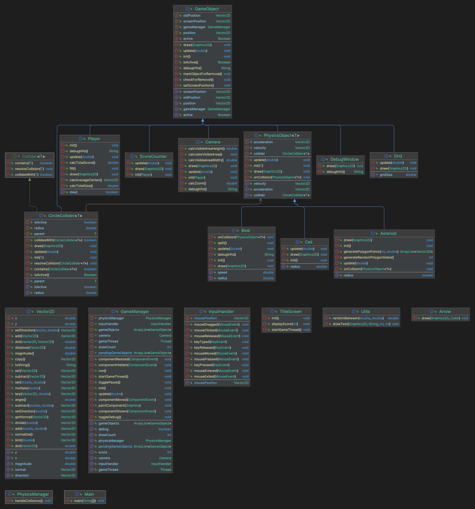

# Cosmic Convergence

Cosmic Convergence combines the mechanics of the Astroids and Agar.io games into a unique gaming experience.

## Game Description

Cosmic Convergence is a space-themed game where the player controls blobs to avoid asteroids and collect cells scattered across the play area. The goal is to grow the blobs by collecting cells while avoiding collisions with asteroids.

## Development Process

The creation of this project involved advanced object-oriented programming concepts and collaboration through version control with GitHub. We utilized several classes, interfaces, and generics that streamlined the implementation of objects and expanded the game's behavior. This approach to programming allowed for a well-structured and easy-to-maintain codebase.

Furthermore, using Github for version control enabled efficient collaboration among the team members. We were able to work on different parts of the project simultaneously, committing and pushing changes as necessary. In situations where we needed to decide on the best implementation to use, separate branches were created and subsequently merged after discussions.

## Game Entities

### Player and Blobs

The player's control consists of blobs, shaped like circles, that move towards the mouse's direction. Their survival and growth depend on the following factors:

- Blob growth is made possible by consuming cells, with each cell increasing the size of the blob.
- Collision with an asteroid splits the blob in half if the blob is larger than the asteroid. If the asteroid is larger, the blob gets destroyed.
- The destruction of a blob causes it to drop cells corresponding to their size at the time of destruction.
- The game ends if all blobs get destroyed.

### Asteroids

Asteroids have the following characteristics and behaviours:

- They have sharp edges and vary in size.
- Their initial movement direction is fixed, and their speed depends on their size; larger asteroids move slower.
- An impact with a blob causes damage depending on the entities' relative sizes. If the blob is larger, the asteroid is destroyed, but if the asteroid is larger, it causes blob destruction.

### Cells

Cells are the primary resource for blob growth. They are characterized as follows:

- Small, stationary circles of varying size.
- Their consumption by a blob causes blob growth and their own destruction.

## Game Environment

### Camera

The gaming environment also involves a responsive camera with the following features:

- Follows the center of the player’s blob formations, enabling a comprehensive view of the game.
- Zooms out in response to the collective size of the blobs, facilitating gaming navigation.

## Game Flow

This game lesson follows a simple yet engaging game flow:

- The player controls the blobs to eat cells and grow larger.
- They navigate their blobs to avoid colliding with asteroids.
- A collision course with an asteroid may cause the blob to split or become destroyed, depending on the relative sizes.
- The destruction of all blobs results in the termination of the game.

## UML Diagram
